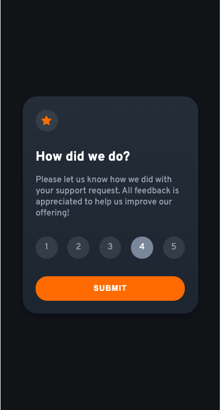
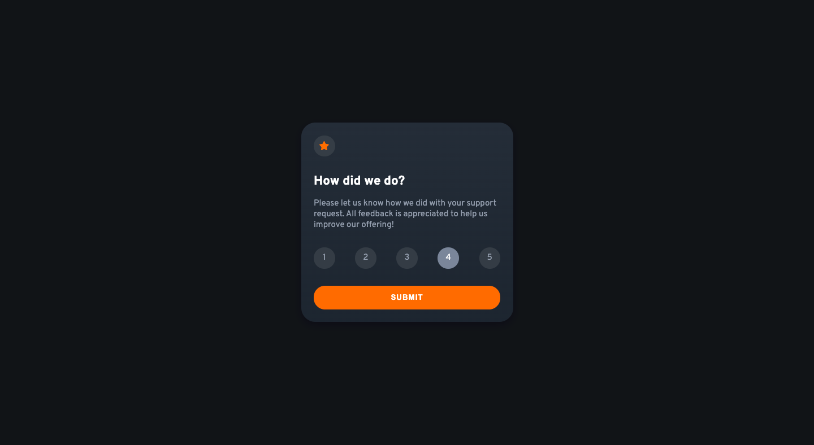
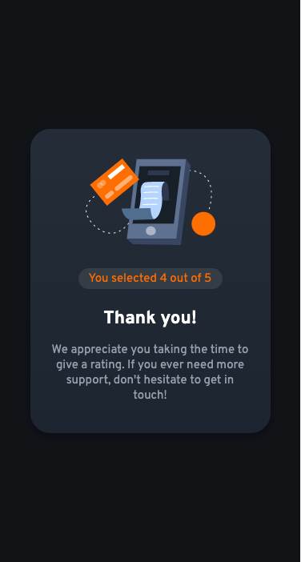
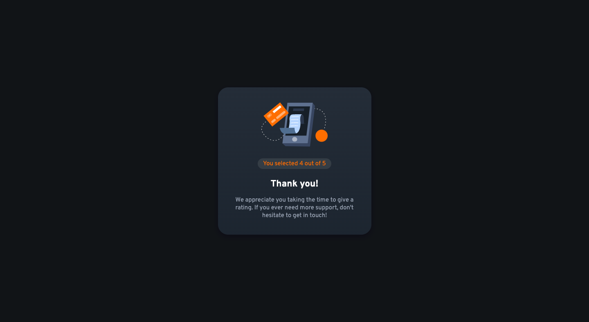

 ## Table of contents

- [Overview](#overview)
  - [The challenge](#the-challenge)
  - [Screenshot](#screenshot)
  - [Links](#links)
- [My process](#my-process)
  - [Built with](#built-with)
  - [What I learned](#what-i-learned)
- [Author](#author)

**Note: Delete this note and update the table of contents based on what sections you keep.**

## Overview

### The challenge

Users should be able to:

- View the optimal layout for the app depending on their device's screen size
- See hover states for all interactive elements on the page
- Select and submit a number rating
- See the "Thank you" card state after submitting a rating

### Screenshot






### Links

- Solution URL: [Add solution URL here](https://your-solution-url.com)
- Live Site URL: [https://642c94afa7346b0f95ec3767--endearing-buttercream-16e63c.netlify.app/](https://642c94afa7346b0f95ec3767--endearing-buttercream-16e63c.netlify.app/)

## My process

#### 1. HTML architecture and CSS class names.
#### 2. CSS Custom Variables for current Color Scheme.
#### 3. Reusable CSS font classes.
#### 4. Assure elements/components are responsible.
#### 5. Implement accessibility for rating buttons (form, input).
#### 6. Functionality for saving user's rating value. (localStorage)
#### 7. Submit button functionality.

### Built with

- Semantic HTML5 markup
- CSS custom properties
- Flexbox
- [jQuery](https://jquery.com/) - JS library

### What I learned
#### 1. Making the rating choices more semantic and accessible.
For the rating choices (1-5), I used form, input type="radio", and label for accessiblity and semantics, and div for styling purposes instead of simply using div tags.
Therefore, I had to figure out a way to cover the default radio buttons in order to implement the desired design. I learned that using "display: none" will make it inaccessible for screen readers, and I didn't want to use "visibility: hidden;" since it would allocated space on the page for the radio buttons. This is why I used the solution below to acheive the desired outcome (hidden from view, but accessible for screen readers):
  ```CSS
  .radio-btn {
    /* Hides radio buttons from user but leave accessible for screen readers. */
    position: absolute; /* removes radio button from normal document flow*/
    opacity: 0; /* make invisible */
  }
  ```

#### 2. Implement functionality/interactivity for the rating buttons.
The rating choices consisted of several sub-elements, which lead to a couple difficulties:
  * Problem #1: Implementing event listeners for click events.
    - I had to consider cases where the user clicked input.radio-btn or label.radio-btn--label, and div.rating-btn, and extract values depending on the element clicked. I used the HTML data- attribute to make the values accessible for the cases in which the user clicks div.rating-btn.

  * Solution #1:
    ```HTML
    <div class="rating-btn mini-circle" data-value="3">
      <input class="radio-btn" type="radio" id="ratingChoice3" name="rating" value="3" />
      <label class="radio-btn--label" for="ratingChoice3">3</label>
    </div>
    ```
    ```JavaScript
    /* Get rating value*/
      if (e.target.value) { // if input.radio-btn is clicked (value)
      ratingValue = e.target.value;
      } else { // if div.rating-btn is clicked (data-value)
      ratingValue = $(this).data('value');
      }
    ```

  * Problem #2: Changing the selected rating button's color when clicked.
    - The 'click' event listener is attached to div.rating-btn, and whenever either the di, input, or label is clicked, event bubbling occurs, so using 'e.currentTarget' (the element that the event listener is attached to; in this case div.rating-btn) to attach the CSS class 'rating-btn--clicked' will apply the desired design no matter which sub-element the user clicks to select rating.

  * Solution #2:
  ```HTML
  <div class="rating-btn mini-circle" data-value="3">
      <input class="radio-btn" type="radio" id="ratingChoice3" name="rating" value="3" />
      <label class="radio-btn--label" for="ratingChoice3">3</label>
    </div>
  ```
  ```JavaScript
  let ratingBtn = $('.rating-btn');
  ratingBtn.on('click', function (e) {
    /* Styling */
    $('.rating-btn').removeClass('rating-btn--clicked');
    e.currentTarget.classList.add('rating-btn--clicked');
  })
  ```

#### 3. Switching pages from index.html to success.html when rating is submitted.
I learned how to use the form tag's action attribute to send the user to the "Thank You" page once rating was selected and submitted. Due to the lack of a server to store user data, I used localStorage to store the user's choice when a rating is selected and to retrieve that data for the "Thank You" page. This way, the data is dynamically bound to span#rating-value of success.html.
```HTML
<div class="rating-result">
    <h2 class="text--accent rating-result--text">You selected <span id="rating-value"></span> out of 5</h2>
</div>
```
I also made sure to clear the localStorage whenever index.html is refreshed to prevent bugs such as rating data existing when the user hasn't made a choice yet:
```JavaScript
localStorage.clear('ratingValue'); // clears previous ratingValue whenever page is refreshed
let ratingValue;
```

#### 4. Enabling the submit button only when the user selects a rating.
I disalbed the submit button by disabling it until the user selects a rating of choice. I included the message 'please select a rating to submit' for enhanced user experience and accessiblity. This message disappears whenever the user selects a rating.
```HTML
<button id="submit-btn" class="submit-btn" type="submit" disabled>SUBMIT</button>
<h3 id="notify-user" class="notify-user">Please select a rating to submit</h3>
```
```JavaScript
let ratingBtn = $('.rating-btn');
ratingBtn.on('click', function (e) {
  /* Remove 'disabled' from #submit-btn */
  document.getElementById('submit-btn').disabled = false;

  /* Remove #notify-user */
  $('#notify-user').css('display', 'none');
})
```


## Author

- Github - [mutalic](https://github.com/mutalic)
- Frontend Mentor - [@mutalic](https://www.frontendmentor.io/profile/mutalic)
- LinkedIn - [Jason Hwang](https://www.linkedin.com/in/mutalic/)
